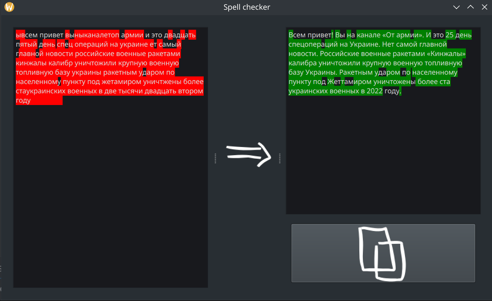

# Spell checking app
Корректор текста, использующий языковые модели.


# Требования
* Python с поддержкой venv (пока работоспособность проверялась с версией 3.11)
* pip


Все остальные зависимости устанавливаются автоматически в виртуальное окружение.

# Установка
## Linux
Запуск скрипта установки производится следующей командой:
```
sh install.sh
```
В процессе установки будет предложен выбор языковой модели для Русского языка,
а также устройства, используемого по умолчанию, для запуска модели.

Также скрипт `install.sh` можно использовать для конфигурации этих настроек.
## Windows
TBA

# Список поддерживаемых моделей
* UrukHan/t5-russian-spell
* ai-forever/RuM2M100-1.2B

В дальнейшем появится поддержка других моделей.

# TODO list:
1. Добавить поддержку других моделей (в том числе и для английского языка).
2. Добавить скрипты установки для Windows.
3. Добавить в конфиг файл префикс для модели.